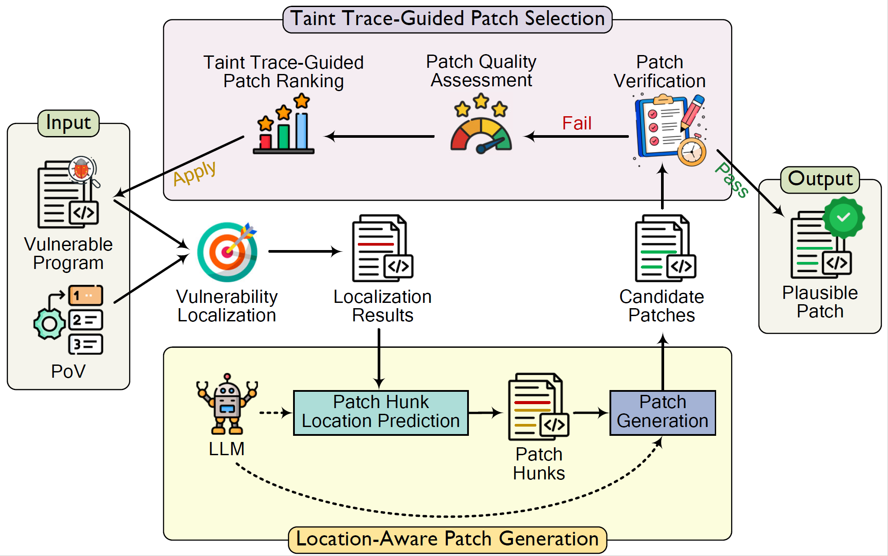

## LoopRepair

This repository shows the source code of paper `Well Begun is Half Done: Location-Aware and Trace-Guided Iterative Automated Vulnerability Repair`.
LoopRepair improves iterative repair strategies by Location-Aware and Trace-Guided Iterative Automated Vulnerability Repair (AVR).

## Workflow



## Install VulnLoc+ Benchmark
___Method 1___: Download docker image (Recomend)
```
docker pull fino2020/looprepair:v1.0
```

___Method 2___: Build from source code
Please go to [CrashRepair](https://github.com/nus-apr/CrashRepair) project to download the docker images. And the original VulnLoc dataset is provided by [VulnLoc](https://github.com/VulnLoc/VulnLoc).

```
git clone https://github.com/nus-apr/CrashRepair.git
cd CrashRepair
./scripts/install
```

It is worth noting that some projects should be executed with special version (project version):
```
spdlog==v1.12.0
z3==z3-4.13.4
pegtl==main
```
Please `git checkout` to the special version of these three project when install VulnLoc+ dataset. Otherwise, this dataset project will error. For example:
```
git clone https://github.com/gabime/spdlog.git
cd spdlog # enter the spdlog directory 
git checkout v1.12.0
```

Futhermore, the built `crepair:aio` image from this method is 24.6GB in size, so please check that the installed image is correct.

## Run LoopRepair
> ___Base Environment___:   
> &ensp;&ensp;This project is built in docker enviroment under WSL2 (Specifically Ubuntu 22.04) with Python 3.9.11 (using Anaconda). So, please:
> > 1. Install Ubuntu 22.04 (I'm not sure whether other Ubuntu version is OK, but this version is suitable) by yourself.
> > 2. Install docker under Ubuntu 22.04.


___Step 1___: Download our LoopRepair project to `path/to/looprepair`. The `path/to/looprepair` is the directory path of your project location, replace it using your own path, the same as following ___Steps___.

___Step 2___: If you have installed this docker image, use the following code to create the container. Replacing `path/to/looprepair` using your own directory path.

```
docker run  --name LoopRepair  -v path/to/looprepair/results:/results   -v path/to/looprepair/logs:/logs -v path/to/looprepair/src:/looprepair -t fino2020/looprepair:v1.0
```

___Step 3___: Use the following code to get into the container.

```
docker exec -it crepair:aio bash
``` 

___Step 4___: Install the Anaconda3. wget the Anaconda3-2024.02-1-Linux-x86_64.sh by yourself and install Anaconda3.

1. _Download Anaconda3._
    ```
    wget https://mirrors.tuna.tsinghua.edu.cn/anaconda/archive/Anaconda3-2024.02-1-Linux-x86_64.sh
    ```
2. _Install Anaconda3 and skip the documentation._
    ```
    bash Anaconda3-2024.02-1-Linux-x86_64.sh -b -p $HOME/anaconda3
    ```
3. _Add the Anaconda environment variable._
    ```
    vim ~/.bashrc
    ```
4. _Add these two lines into the bottom of the `~/.bashrc` file._
    ```
    export PATH="/root/anaconda3/bin":$PATH
    source /root/anaconda3/bin/activate
    ```
5. _update ~/.bashrc file._
    ```
    source ~/.bashrc
    ```
6. _Check whether conda is installed._
    ```
    conda -V
    ```

___Step 5___: Create a vitual environment.

```
conda create -n looprepair python=3.9.11
conda activate looprepair
```

___Step 6___: pip install these packages that needed. Add `-i https://mirrors.tuna.tsinghua.edu.cn/pypi/web/simple some-package` if you need.

```
cd looprepair 
pip install -r requirements.txt -i https://mirrors.tuna.tsinghua.edu.cn/pypi/web/simple some-package
```

___Step 7___: Add OpenAI `base_url` and `api_key` in `Lines 12, 13, and 15` in [LLMRepair.py](./src/looprepair/LLMRepair.py).
```
openai.api_key = ""
openai.base_url = ""
api_model = "gpt-4o-mini" # you can change the model name here.
```

___Step 8___: Run repair. *Noting that `copy` the `/data/` directory first using `cp /data/ /data_bak/`, because the original program will be modified if you terminate.*
1. _Noting that `copy` the `/data/` directory first._
    ```
    cp -r /data/ /data_bak/
    ```
2. _Run [looprepair](./src/looprepair/run.py)._
    ```
    python run.py
    ```
3. _After every time you run or terminate the `run.py`, remove `/data/` directory and replace it using `/data_bak` directory. This step aim to keep the program the same as original program._
    ```
    rm -rf /data/ 
    cp /data_bak/ /data/
    ```

## Write at Last
If you have any questions, feel free to raise an issue and contact me.

Lastly, our project is an improvement based on the [CrashRepair](https://github.com/nus-apr/CrashRepair) project,
and we would like to thank Ridwan Shariffdeen and other contributors for their contributions to the original project.
